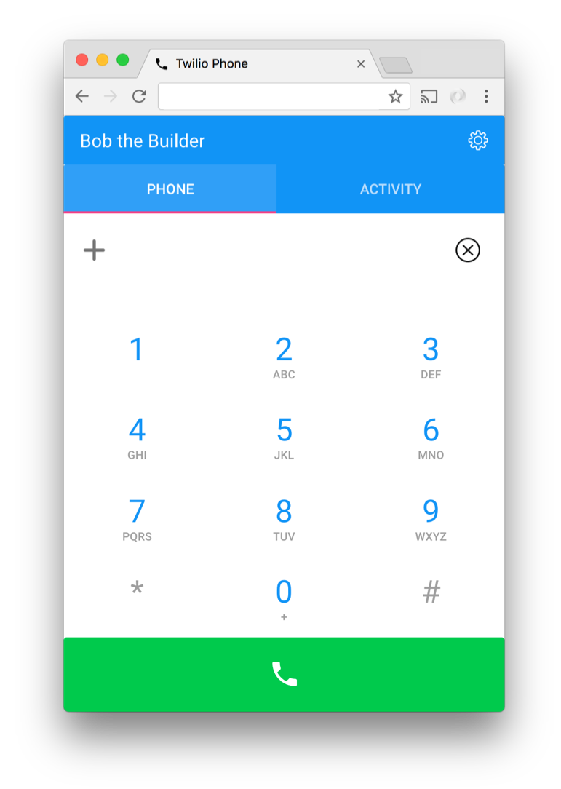

# Twilio Phone

A simple phone build with Twilio Client WebRTC, Node, AngularJS Material and MongoDB.



NOTE: Please review the code if you do not use it just as demo. It has been designed for demo purposes and has not been separately security checked.

## You Need a Phone with More Features?

This repository is not in active development anymore. If you want to try out an up-to-date WebRTC phone with many more feature written in Typescript and React, please check out [Summer Camp](https://github.com/public-park/summer-camp).

The linked phone repository can manage user availability, supports multiple users on one account and you have more options on the call routing.

## One Click Install - Heroku

This will install the application and all the dependencies on Heroku (login required) for you. As part of the installation, the Heroku app will walk you through configuration of environment variables. Please click on the following button to deploy the application.

[](https://heroku.com/deploy?template=https://github.com/nash-md/twilio-phone-ng)

After the installation has completed please open `https://<your_application_name>` in your browser.

## Manual Install - On Your Own Server or Machine

This project requires [Node.js](http://nodejs.org/) 12 or greater and MongoDB.

You can download and run MongoDB
yourself ([OS X](http://docs.mongodb.org/manual/tutorial/install-mongodb-on-os-x/),
[Linux](http://docs.mongodb.org/manual/tutorial/install-mongodb-on-ubuntu/),
[Windows](http://docs.mongodb.org/manual/tutorial/install-mongodb-on-windows/)).

On OS X, the maybe the easiest way to get MongoDB running locally is to install
via [Homebrew](http://brew.sh/).

```bash
brew install mongodb
```

You should then be able to run a local server with:

```bash
mongod
```

By default, there will be a local database running that's not password protected. Create a database for the application.

### Install Dependencies

Navigate to the project directory in your terminal and run:

```bash
npm install
```

In order to run the demo you will need to set the following environment variables:

- `MONGODB_URI`

Start the application

`node app.js`

After the server is started open `https://<your_application_name>` in your browser.

**Note:**

Before you can make and receive phone calls register with a nickname and a password. After your first login press the setup icon on the top right. The demo application will ask you for your `TWILIO_ACCOUNT_SID` and`TWILIO_AUTH_TOKEN` and will use your account credentials to configure the TwiML Application and the Twilio number for you.

Please create a separate sub-account within Twilio and install this app using that sub-accoount credentials.

On Google Chrome a secure HTTPS connection is required to do phone calls via WebRTC. Use a tunnel that supports HTTPS such as ngrok, which can forward the traffic to your webserver.

## Questions?

Message [mdamm@twilio.com](mailto:mdamm@twilio.com)

## License

MIT

## Contributors

- Matthias Damm <mdamm@twilio.com>
